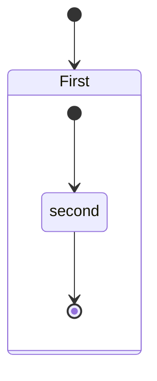

# Markdownサンプル

# いろはにほへと
いろはにほへと　ちりぬるを
わかよたれそ　　つねならむ
うゐのおくやま　けふこえて
あさきゆめみし　ゑひもせすん
色は匂へど　散りぬるを
我が世誰そ　常ならむ
有為の奥山　今日越えて
浅き夢見じ　酔ひもせず


# 見出し1
## 見出し2
### 見出し3
#### 見出し4
##### 見出し5
###### 見出し6

## リスト
- リスト1
    - ネスト リスト1_1
        - ネスト リスト1_1_1
        - ネスト リスト1_1_2
    - ネスト リスト1_2
- リスト2
- リスト3

## リスト
1. 番号付きリスト1
    1. 番号付きリスト1_1
    1. 番号付きリスト1_2
1. 番号付きリスト2
1. 番号付きリスト3

## 引用
> 引用

## 二重引用
> 引用
>> 二重引用

## pre

```
<?php

class Hoge
{
    protected $hoge;

    public function __construct(string $hoge)
    {
        $this->hoge = $hoge;
    }

    ・・・

    public function greeting(string $name)
    {
        echo 'Hello, '. $name;
    }
}
```

```php
<?php

class Hoge
{
    protected $hoge;

    public function __construct(string $hoge)
    {
        $this->hoge = $hoge;
    }

    ・・・

    public function greeting(string $name)
    {
        echo 'Hello, '. $name;
    }
}
```


## Code記法
`Code記法`

## 強調

### 斜体
*斜体*
_斜体_

### 強調
**強調** 
__強調__


## 水平線

***

___

---

*    *    *

## リンク
[Google先生](https://www.google.co.jp/)

## 定義参照リンク
[こっちからgoogle][google]
その他の文章
[こっちからもgoogle][google]

[google]: https://www.google.co.jp/

## 取り消し線
~~取り消し線~~

## テーブル
|header1|header2|header3|
|:--|--:|:--:|
|align left|align right|align center|
|a|b|c|

## 画像


## 画像（サイズ指定）


## ページ内リンク
* [to header1](#header1)
* [to header2](#header2)

<!-- some long code -->

[return to menu](#menu)

## markdown-it-container
::: info
📝 here be dragons
:::

::: warning
⚠ here be dragons
:::

::: danger
💀 here be dragons
:::

## markdown-it-plantuml
@startuml
Bob -[#red]> Alice : hello
Alice -[#0000FF]->Bob : ok
@enduml

## mermaid


## 絵文字
💬🗨🗯💭💥🪓📝⚠💀🥞

## 改ページ
<div class="page"/>

# 奥付
**本のタイトル**
本のサブタイトル
XXXX年X月XX日 初版発行
著者 : [@c_a_p_engineer](https://twitter.com/c_a_p_engineer)
